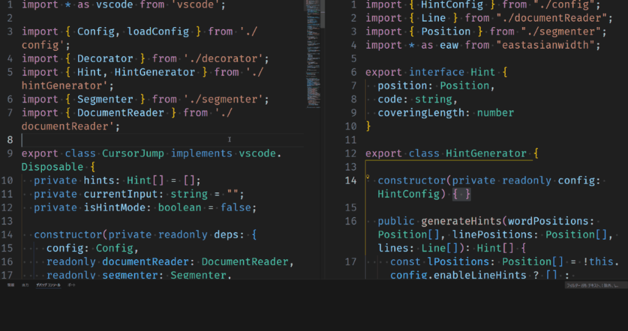

# カーソルジャンプ

VSCodeで単語や行頭にカーソルをジャンプできる拡張機能です。

`ctrl + g` でヒントを表示し、移動したい位置に表示されている文字列を入力すると、その位置にカーソルをジャンプできます。

## 和文でのカーソル移動

和文に対応し、単語ごとにヒントを表示します。

## コードでのカーソル移動

コードでも利用できます。また、マルチペインでも移動できます。

## コマンド

- `cursorJump.startHintMode`
  - ヒントを表示します。
  - デフォルトでは `ctrl + g` で起動できます。
  - 入力した文字を取り消したい場合は `backspace` で取り消せます。
- `cursorJump.endHintMode`
  - ヒントを非表示にします。
  - デフォルトではヒント表示中にもう一度 `ctrl + g` を押すか `esc` で起動できます。

## 設定可能項目

- `cursorJump.hint.enableLineHints`
  - 行頭にヒントを表示してジャンプできるようにします。
  - デフォルトでは無効になっています。
- `cursorJump.hint.enableWordHints`
  - 単語単位のヒントを表示してジャンプできるようにします。
  - デフォルトで有効です。
- `cursorJump.hint.hintChars`
  - ヒントに使用する文字。
  - デフォルトは[a-z]です
- `cursorJump.hint.backgroundColor`
  - ヒントの背景の色
  - デフォルトは `white` です。
- `cursorJump.hint.foregroundColor`
  - ヒントの文字色
  - デフォルトは `black` です。
- `cursorJump.hint.typedChar`
  - ヒントの入力済み部分を表す文字。
  - デフォルトは `_` です。
- `cursorJump.autoSwitchInputMethod.enable`
  - trueの場合、ヒント表示時にIMEを自動で半角に切り替え、終了時に元に戻します。Windowsのみ有効です。macOSでは常に何もしません。
  - デフォルトは `true` です。

## ライセンス

この拡張機能のコードは[MIT Licenseで配布](./LICENSE)します。

また、この拡張機能には以下のコードの一部を改変・利用しています。

- [TinySegmenter](http://chasen.org/~taku/software/TinySegmenter/)
  - [BSD-3 LICENSE](./THIRD_PARTY/TinySegmenter.txt)
- [vimium](https://github.com/philc/vimium)
  - [MIT LICENSE](./THIRD_PARTY/vimium.txt)
- [zenhan](https://github.com/iuchim/zenhan)
  - [Unlicense](./THIRD_PARTY/zenhan.txt)

その他、以下の拡張機能を参考に実装しました。

- [vscode-jumpy](https://marketplace.visualstudio.com/items?itemName=wmaurer.vscode-jumpy)
  - [MIT LICENSE](./THIRD_PARTY/jumpy.txt)
- [vscode-jump-to-hint](https://marketplace.visualstudio.com/items?itemName=shuworks.vscode-jump-to-hint)
  - [MIT LICENSE](./THIRD_PARTY/vscode-jump-to-hint.txt)
- [jumpy2](https://marketplace.visualstudio.com/items?itemName=DavidLGoldberg.jumpy2)
  - [MIT LICENSE](./THIRD_PARTY/jumpy2.txt)
- [spzenhan.vim](https://github.com/kaz399/spzenhan.vim)
  - [Unlicense](./THIRD_PARTY/spzenhan.vim.txt)
